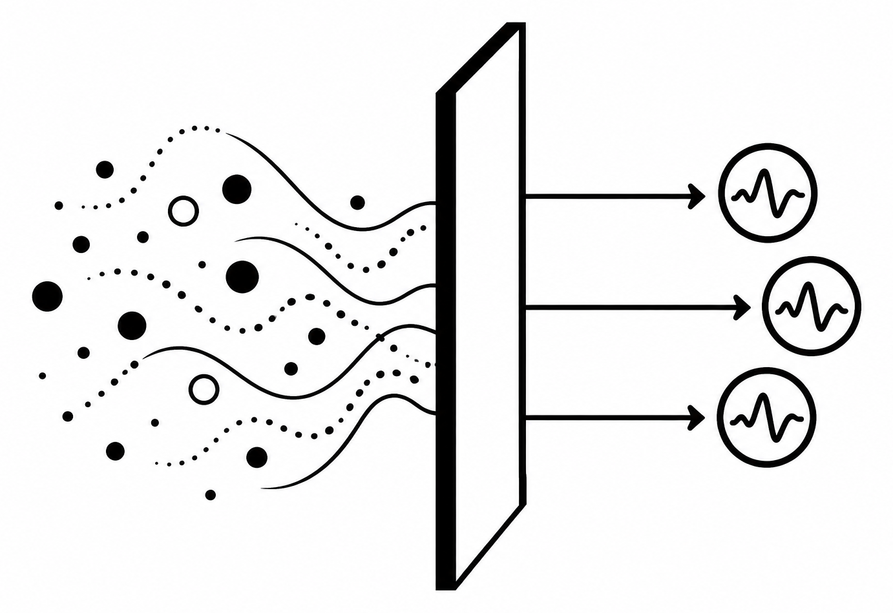

# Interface Closure and Representational Sealing

<p align="left">
  
</p>

Computational supplement to:

**Peter Kahl, ‘What Conceptual Change Cannot Recover: Interface Closure and Representational Sealing’ (2026).**

This repository contains simulations accompanying the paper's analysis of **interface closure** and **representational sealing**. The code illustrates the distinction between identifying a latent role-level structure and gaining epistemic access to structure that lies beyond the stipulated interface.

The repository also contains the complete console output of the canonical reference run reported in §10.3 of the paper, allowing the numerical claims in the paper to be inspected without first rerunning the simulation.

## Three-detector simulation

`three_detector.py` implements the toy model developed in §10 of the paper.

A binary latent role-level state `G ∈ {a, b}` generates conditionally independent observations through noisy binary detectors:

```text
G → (X1, X2, X3)
```

The simulation examines four cases.

### 1. Two detectors

With only `X1` and `X2`, the latent-class model is ordinarily non-identifiable. Multiple materially different parameterisations can fit the same observational distribution.

Multiple random EM initialisations are used to make this numerical multiplicity visible.

The numerical result is illustrative. The finite collection of solutions encountered by the program does not itself prove the mathematical structure of the non-identifiable solution set.

### 2. Three detectors

Adding a suitable third conditionally independent detector generically identifies the role-level latent structure, subject to permutation of the two latent-state labels.

The simulation therefore distinguishes:

```text
role-level underidentification

        from

ordinary latent-label symmetry
```

For the parameters used here, repeated EM initialisations recover the same role-level structure in its two label orientations.

### 3. Role-mediated intervention

The simulation then introduces a randomised intervention `U`:

```text
U → G → (X1, X2, X3)
```

The intervention changes the probability of the latent role-level state and substantially enriches the available regime information.

It nevertheless introduces no direct measurement path to the stipulated role-exceeding property `Q`.

The example therefore illustrates an important point developed in the paper:

> **Intervention does not, merely by being intervention, escape an interface.**

An intervention mediated entirely through the same role-level state may improve identification of that state without providing access to distinctions beyond it.

### 4. Conventional statistical anchor

Finally, the model stipulates:

```text
P(X1=1 | G=a) = 0.9
```

This removes the ordinary statistical label ambiguity by fixing an orientation of the latent model.

It does not introduce a new measurement path or independently identify a role-exceeding realiser.

The example therefore distinguishes:

```text
role identification
        ≠
statistical orientation
        ≠
realiser identification
```

## Interface interpretation

The conceptual architecture represented by the simulation is:

```text
role-exceeding realiser / property Q
                |
                v
         role-level state G
          /      |      \
         v       v       v
        X1      X2      X3
```

In the intervention case:

```text
U → G → (X1, X2, X3)
```

There is deliberately no direct `Q → Xi` measurement path.

This matters for interpretation. The simulation does **not** establish that a real system is interface-closed, that role-exceeding structure exists, or that such structure is physically unobservable. Those are substantive premises that must be independently defended when applying the theory.

The simulation instead asks what follows **conditional on the stipulated interface architecture**.

## Statistical label symmetry and realiser permutation

Two different permutation claims must not be conflated.

### Statistical label symmetry

The labels `a` and `b` assigned to the two latent classes are arbitrary. Exchanging

```text
(pi, p, q)
```

with

```text
(1-pi, q, p)
```

leaves the observational likelihood unchanged.

`three_detector.py` verifies this equality numerically.

This is ordinary statistical label redundancy.

### Realiser permutation

Realiser permutation is a different claim. It concerns exchanging role-exceeding realisers while holding fixed everything available through the stipulated interface.

The simulation's likelihood does not directly demonstrate such a permutation because `Q` is deliberately absent from the likelihood.

Rather, invariance with respect to role-exceeding structure follows, within the toy model, from the stipulated interface architecture: the simulated observational system contains no `Q`-sensitive path.

The distinction is therefore:

```text
statistical label symmetry
        ≠
role-exceeding realiser permutation
```

The first is directly visible in the fitted latent-class model. The second is an interface-level claim.

## What the simulation does not prove

The code is an illustration, not a proof of the mathematical or philosophical claims developed in the paper.

In particular:

- numerical convergence from multiple EM initialisations does not prove global identifiability;
- observing multiple near-optimal two-detector fits does not establish the mathematical structure of the non-identifiable solution set;
- generic identifiability of the three-indicator latent-class model depends on mathematical results and their assumptions, not on this simulation;
- expectation-maximisation is a local optimisation procedure and may converge to local optima or numerically distinct approximations;
- finite-sample estimates need not equal the population parameters used to generate the data;
- statistical label symmetry is not itself evidence of role-exceeding realiser permutation;
- an intervention mediated through `G` does not establish that every possible intervention would remain behind the interface; and
- the simulation does not establish interface closure in any real physical, computational, biological or social system.

The relevant identifiability literature, including Kruskal (1977) and Allman, Matias and Rhodes (2009), is discussed and cited in the accompanying paper.

## Requirements

The simulation requires:

- Python 3
- NumPy

No external data files are required. The observations analysed by the program are generated internally from the parameters and pseudo-random seed specified in the source code.

A minimal installation is:

```bash
python -m venv .venv
source .venv/bin/activate
pip install numpy
```

## Running the simulation

Run:

```bash
python three_detector.py
```

The script reports:

1. distinct near-optimal fits obtained with two detectors;
2. the two label-equivalent solutions recovered with three detectors;
3. the corresponding solutions under a role-mediated intervention;
4. the single statistical orientation obtained after conventional anchoring; and
5. a direct numerical check of likelihood invariance under latent-label exchange.

To save a new run for comparison with the archived reference output:

```bash
python three_detector.py > my_run.txt
```

## Reference output

The repository includes the complete, unedited console output from the canonical run used for the numerical illustration reported in §10.3 of the accompanying paper:

```text
output/three_detector_output.txt
```

The reference output was generated by `three_detector.py` version **1.0.1** using the fixed pseudo-random seed and generating parameters specified below.

The reference output is provided for **reproducibility and scrutiny**. It is not an independent empirical dataset: the observations are simulated by the program itself. Its purpose is to record the exact numerical run underlying the statements made in §10.3 and to permit comparison with independently reproduced runs.

A reproduced run can be compared directly with the reference output, for example:

```bash
python three_detector.py > my_run.txt
diff -u output/three_detector_output.txt my_run.txt
```

Exact textual identity is not guaranteed across Python, NumPy, platform or numerical-library versions. Small floating-point differences do not by themselves indicate a failure to reproduce the qualitative results.

## Reproducibility

The generating parameters and random seed are defined explicitly in `three_detector.py`.

The canonical simulation uses:

```text
random seed = 1
N = 20,000

P(G=a) = 0.30

P(Xj=1 | G=a) = [0.90, 0.80, 0.85]
P(Xj=1 | G=b) = [0.20, 0.10, 0.30]
```

For the intervention:

```text
P(G=a | U=0) = 0.20
P(G=a | U=1) = 0.80
```

Each reported model is fitted from 40 random EM initialisations.

A fixed pseudo-random seed is used for reproducibility. Small numerical differences may nevertheless occur across Python, NumPy, platform or numerical-library versions.

## Expected qualitative results

A canonical run should exhibit the following pattern:

| Case | Expected result |
|---|---|
| Two detectors | Many distinct near-optimal parameterisations |
| Three detectors | One role-level structure in two label orientations |
| Role-mediated intervention | Enriched role-level identification, but the two label orientations remain |
| Conventional anchor | One statistical orientation |
| Label-swap check | Equal likelihoods up to floating-point error |

The precise fitted parameter values are sample-dependent. The important result is the structure of the comparison rather than exact equality with the generating parameters.

For the exact numerical output reported with the paper, see `output/three_detector_output.txt`.

## Interpretation of the intervention

The intervention deserves particular care.

The model contains:

```text
U → G → X
```

but not:

```text
U → Q → X
```

or:

```text
Q → X
```

Consequently, the intervention can reveal additional information about how the role-level state `G` behaves across regimes while remaining insensitive to distinctions that are not represented at the interface.

A different intervention or measurement that generated an independently `Q`-sensitive response would change the epistemic situation. It would amount to breaching or extending the interface assumed by this toy model.

The simulation therefore does not claim that intervention can never overcome sealing. It illustrates why **intervention confined to the same interface need not do so**.

## Interpretation of the conventional anchor

The stipulation

```text
P(X1=1 | G=a) = 0.9
```

selects one orientation of the statistical model.

It therefore solves a statistical naming problem:

```text
Which latent component is designated a?
```

It does not, by itself, answer a different question:

```text
Which independently specified role-exceeding realiser occupies that position?
```

This distinction is central to the use of the example in the accompanying paper.

## Repository structure

```text
interface-closure-representational-sealing/
├── README.md
├── LICENSE
├── CITATION.cff
├── .gitignore
├── three_detector.py
├── output/
│   └── three_detector_output.txt
└── assets/
    └── representational-sealing.png
```

## Version correspondence

The numerical results discussed in §10.3 of the accompanying paper correspond to:

```text
three_detector.py version 1.0.1
```

The archived software release should therefore be used when reproducing or citing the numerical results associated with that version of the paper. Later revisions of the code may produce different numerical output or implement additional analyses.

## Associated paper

Peter Kahl, **‘What Conceptual Change Cannot Recover: Interface Closure and Representational Sealing’** (2026).

Publication and DOI details will be added when available.

## Citation

If you use the theoretical argument, please cite the accompanying paper.

If you use or modify the software, please also cite the archived software release. Citation metadata are provided in `CITATION.cff`.

The paper and software are separate scholarly objects and may therefore have separate persistent identifiers.

## Licence

The source code in this repository is released under the **MIT License**. See `LICENSE`.

The accompanying scholarly paper is a separate work and is licensed under **CC BY 4.0**, unless otherwise stated.

## Disclaimer

This software is provided to support reproducibility and scrutiny of the accompanying theoretical argument.

Its numerical output should be interpreted together with the assumptions, definitions, limitations and argument of the paper. The output is not, by itself, empirical evidence for the existence of representational sealing or interface closure in any real-world system.

The software is provided ‘as is’, without warranty of any kind, as specified in the MIT License.

## Author

**Peter Kahl**
Independent researcher, Lex et Ratio
ORCID: 0009-0003-1616-4843
https://www.lexetratio.com/